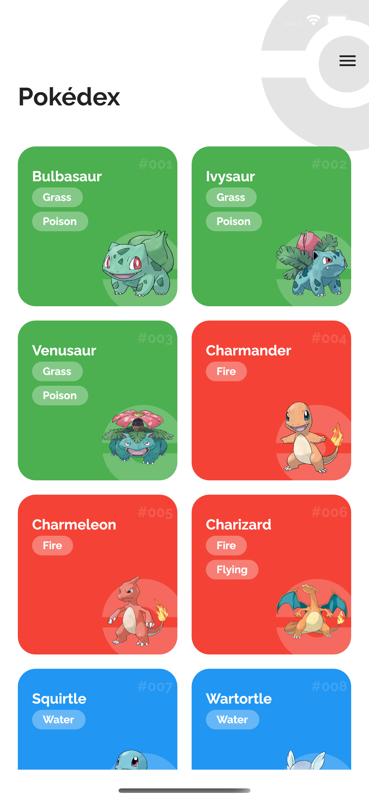
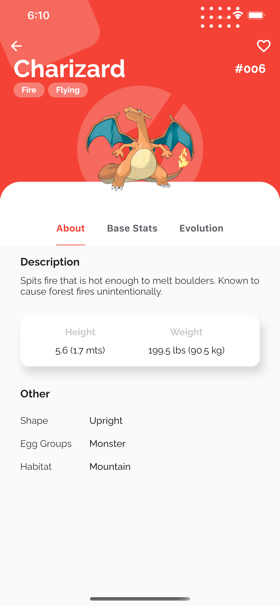
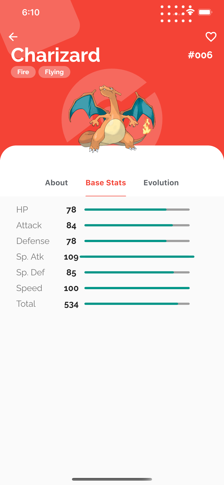
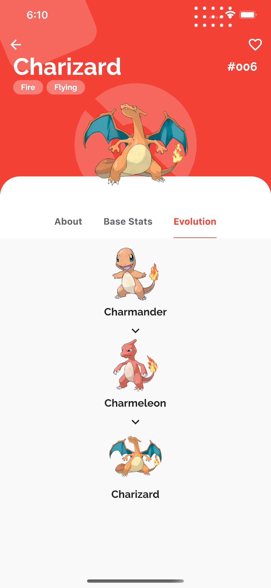

# App Pokedex

Project made for studies in the flutter and MobX.

## Preview 📷

  

  
  
  
  
 

 ## Installation 🔨

- Add [Flutter](https://flutter.dev/docs/get-started/install) to your machine

- Open this project folder with Terminal/CMD and run `flutter packages get`

- Run `flutter run` to build and run the debug app on your emulator/phone
